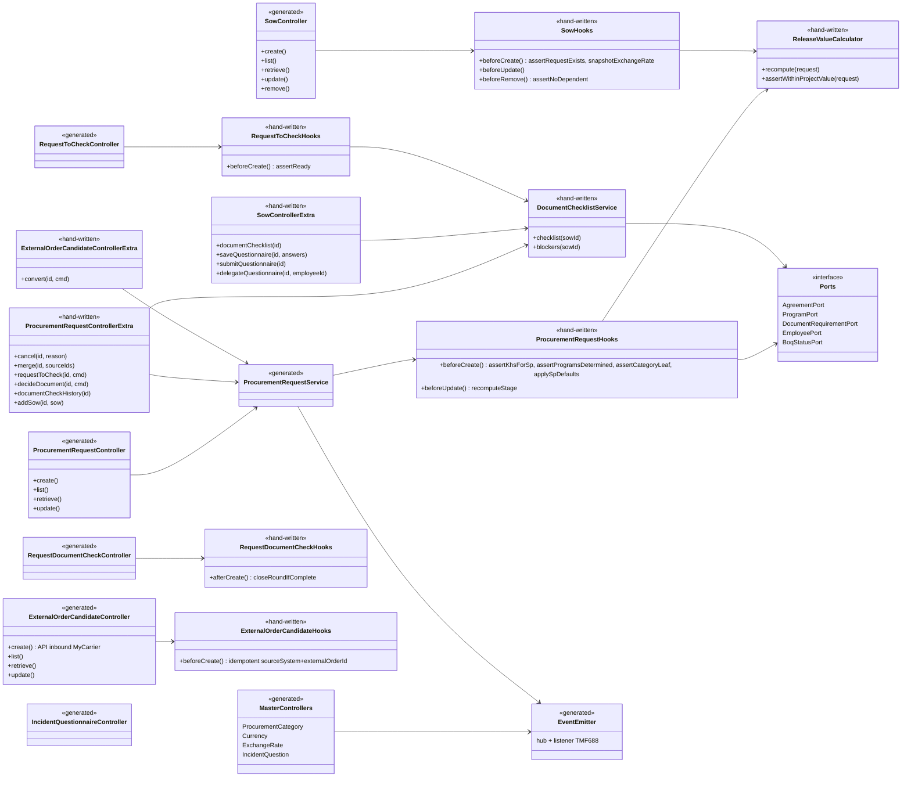

# C12 · Analisis kelengkapan spec, ERD, dan class diagram

Dokumen ini membandingkan spec C12 dengan:
- skill `bsm-programmer-spec`, yaitu `references/komponen/pengadaan-awal.md` (C12: endpoint, `C12-class`, `C12-erd`) serta `database/proc.md` dan `mst.md`;
- aturan dari skill `bsm-solution-design` (v1.5).

Pengecekan dilakukan 7 Oktober 2026 terhadap tmfgen di repo ini.

## 1. Kesimpulan

| Aspek | Status | Catatan |
|---|---|---|
| **Endpoint** | ✅ lengkap di **kontrak** (`1.0.0/contract/*-contract.oas.yaml`, 55 path) | Spec generator (`1.0.0/openapi/`, 45 path) sengaja hanya memuat resource yang disimpan. 10 endpoint aksi/turunan, termasuk `documentChecklist`, hanya ada di kontrak dan ditulis tangan, karena tmfgen menjadikan path seperti itu tabel (lihat 2.1). |
| **Tabel ERD C12** | ✅ 13 dari 13 tabel terwakili sebagai resource/sub-entity | Bentuk fisiknya berbeda karena strategi referensi generator (lihat 3.2). |
| **FK antar tabel C12** | ✅ semua relasi ERD C12 ada | `sow→currency`, `sow→exchange_rate`, `request_to_check→sow`, `request_document_check→request/sow/request_to_check`, `incident_questionnaire→sow/request`, `exchange_rate→currency` ×2. |
| **Class diagram** | ⚠️ sebagian di-generate | Generator membuat Controller, Service, Entity, dan DTO per resource. Service domain, port, dan publisher di `C12-class` ditulis tangan (lihat 4). |
| **Build & test** | ✅ | `scaffold` + `emit` (ref-strategy `table`): 26 entity, `nest build` lulus, **19 suite / 563 test lulus**. 36 enrichment diterapkan dan semua resource cocok. |

## 2. Endpoint: Analisis Programmer C12 vs spec

### 2.1 Kenapa `documentChecklist` dan sejenisnya tidak ada di spec generator

tmfgen (`src/ir/buildIR.mjs` → `discoverResources`) menjadikan **setiap path** selain `/hub` dan `/listener` sebuah resource. Hasil ujinya:
- `GET /sow/{id}/documentChecklist` dengan schema baru menjadi **resource bersarang `DocumentChecklist` + tabel `document_checklist`**. Ini salah, karena checklist dihitung dari konfigurasi dokumen, bukan disimpan.
- `POST /procurementRequest/{id}/cancel` dilewati dengan peringatan.
- tmfgen tidak punya vendor extension untuk melewatkan sebuah path.

Karena itu, endpoint seperti ini ditaruh di **kontrak lengkap**. Kontrak dibangun dari `build-spec.mjs` yang sama, jadi isinya tidak mungkin berbeda dari spec generator. Setiap endpoint diberi tanda `x-bsm-implementation` (file `*.controller.extra.ts`) dan `x-bsm-source`.

> Koreksi atas versi sebelumnya: dulu endpoint ini hanya disebut di README sebagai "ditulis tangan" dan tidak ada di YAML mana pun. Itu memang gap kontrak, dan kini sudah ditutup.

### 2.2 Matriks endpoint

Keterangan:
- **G** = di-generate tmfgen dari spec `openapi/`.
- **K** = hanya ada di kontrak, ditulis tangan di controller.extra.
- **≈** = bentuk TMF yang setara.

| # | Analisis Programmer C12 | Spec / kontrak | Status |
|---|---|---|---|
| 1 | `POST /bsm/v1/procurementRequest` | `POST /procurementRequest` | G |
| 2 | `GET /bsm/v1/procurementRequest` | `GET /procurementRequest` | G |
| 3 | `GET /bsm/v1/procurementRequest/{id}` | `GET /procurementRequest/{id}` | G |
| 4 | `PATCH /bsm/v1/procurementRequest/{id}` | `PATCH /procurementRequest/{id}` | G |
| 5 | `POST /bsm/v1/procurementRequest/{id}/sow` | `POST /procurementRequest/{id}/sow` (alias `POST /sow`) | K + G≈ |
| 6 | `PATCH /bsm/v1/sow/{id}` | `PATCH /sow/{id}` | G |
| 7 | `DELETE /bsm/v1/sow/{id}` | `DELETE /sow/{id}` | G |
| 8 | `POST /bsm/v1/procurementRequest/{id}/cancel` | `POST /procurementRequest/{id}/cancel` (atau PATCH `state=cancelled`) | K |
| 9 | `POST /bsm/v1/procurementRequest/{id}/merge` | `POST /procurementRequest/{id}/merge` | K |
| 10 | `GET /bsm/v1/procurementCategory` | `GET /procurementCategory` (+ create/retrieve/patch admin) | G |
| 11 | `GET /bsm/v1/exchangeRate` | `GET /exchangeRate` (filter `currency.id`, `rateDate`) | G≈ |
| 12 | **`GET /bsm/v1/sow/{id}/documentChecklist`** | **`GET /sow/{id}/documentChecklist`** | **K** |
| 13 | `GET /bsm/v1/incidentQuestion` | `GET /incidentQuestion` | G |
| 14 | `PUT /bsm/v1/sow/{id}/incidentQuestionnaire` | `PUT /sow/{id}/incidentQuestionnaire` (data di resource `IncidentQuestionnaire`) | K + G |
| 15 | `POST .../incidentQuestionnaire/submit` | idem | K |
| 16 | `POST .../incidentQuestionnaire/delegate` | idem | K |
| 17 | `POST /bsm/v1/procurementRequest/{id}/requestToCheck` | `POST /procurementRequest/{id}/requestToCheck` (membuat baris `RequestToCheck`) | K + G |
| 18 | `POST /bsm/v1/procurementRequest/{id}/documentCheck` | `POST /procurementRequest/{id}/documentCheck` (data di resource `RequestDocumentCheck`) | K + G |
| 19 | `GET /bsm/v1/procurementRequest/{id}/documentCheck` | idem; juga `GET /requestDocumentCheck` | K + G |
| 20 | `POST /bsm/v1/externalOrderCandidate` (inbound) | `POST /externalOrderCandidate` | G |
| 21 | `GET /bsm/v1/externalOrderCandidate` | `GET /externalOrderCandidate` | G |
| 22 | `POST /bsm/v1/externalOrderCandidate/{id}/convert` | `POST /externalOrderCandidate/{id}/convert` | K |
| — | (tidak ada di Analisis Programmer) | `/hub` GET/POST, `/hub/{id}` GET/DELETE, 23 listener TMF688, CRUD master `Currency` | G (konvensi TMF) |

**Base path:** Analisis Programmer memakai `/bsm/v1/...`, sedangkan spec yang diturunkan dari judul menghasilkan `tmf-api/procurementRequestManagement/v1`. Pakai `-b bsm/procurementRequestManagement/v1` bila ingin awalan `bsm`.

## 3. ERD

### 3.1 Tabel `C12-erd` vs spec

| Tabel ERD C12 | Resource / sub-entity di spec | Catatan |
|---|---|---|
| `proc.procurement_request` | `ProcurementRequest` | `request_no` → `requestNumber`, `project_name` → `name`, `company_code_id` → `companyCode` (ditambahkan di revisi ini). |
| `proc.procurement_request_program` | sub-entity `ProcurementProgramAllocation` | `allocatedAmount`, `allocationNote`. |
| `proc.procurement_request_assistant` | sub-entity `RelatedPartyAssignment` (`role = picAssistant`) | Pola TMF relatedParty. |
| `proc.sow` | `Sow` | `currency_id` → FK `Currency`. `exchange_rate_id` → FK `exchangeRateSource` (nama kolomnya `exchange_rate_source_id`, karena nama `exchangeRate` sudah dipakai untuk nilai snapshot). |
| `proc.deliverable` | sub-entity `Deliverable` | |
| `proc.request_to_check` | `RequestToCheck` | Revisi: kini satu baris per SOW (`sow` tunggal, null = semua) sesuai ERD. Versi lama memakai array `sowSelection`. |
| `proc.request_document_check` | `RequestDocumentCheck` | **Baru** di revisi ini (1.3.1, dipakai Proses 3). |
| `proc.external_order_candidate` | `ExternalOrderCandidate` | `MYTENS` dibuang (A06). |
| `proc.incident_question` | `IncidentQuestion` | **Baru**. Temuan demo, tidak ada di v1.5. |
| `proc.incident_questionnaire` | `IncidentQuestionnaire` | **Baru**. Temuan demo, tidak ada di v1.5. |
| `mst.procurement_category` | `ProcurementCategory` | `parent_id` → `parentCategory` (referensi ke dirinya sendiri, di-flatten). |
| `mst.currency` | `Currency` | **Baru**. Usulan valas. |
| `mst.exchange_rate` | `ExchangeRate` | **Baru**. Usulan valas. |

### 3.2 Perbedaan fisik yang disebabkan generator (perlu diputuskan)

1. **Referensi lintas komponen menjadi tabel ref.** Dengan ref-strategy default `table`, referensi tunggal seperti `requesterUnit` dan `pic` disimpan di tabel ref bersama (`organization_unit_ref`, `employee_ref`, `agreement_ref`, …) dengan FK `requester_unit_id`. Di ERD C12, kolom yang sama adalah FK langsung ke `core.organization_unit`. Karena tiap servis punya DB sendiri, tabel ref ini menyimpan salinan `{id, href, name}` dari entitas komponen lain. Polanya sah, tetapi berbeda dari ERD.
2. **`Money` menjadi tabel `money`.** `projectValue`, `totalReleaseValue`, dan `releaseValue` disimpan di tabel `money` dengan FK `project_value_id`, bukan sebagai kolom `numeric(18,2)`.
3. **Angka desimal — sudah diperbaiki (7 Okt 2026).** Generator mendukung `format: decimal` + `x-db-precision`/`x-db-scale` → `numeric(p,s)` dengan transformer ke number saat dibaca. Spec C12: `Money.value` `numeric(18,2)`, `exchangeRate`/`rate` `numeric(18,6)`, `weightPercentage`/`weight` `numeric(5,2)`, `impactScore` `numeric(7,2)`. Uji runtime SQLite: `1234567890123.45`, `0.1`, `0.2`, `16250.123456` kembali persis.
8. **Siklus eager + cascade dua arah membuat create berputar sampai kehabisan memori.** Versi awal spec punya `ProcurementRequest.externalOrderCandidate` sekaligus `ExternalOrderCandidate.procurementRequest`. Dua-duanya `eager: true, cascade: true`, sehingga `POST /procurementRequest` crash (heap out of memory) walau build dan unit test lulus. Sudah diperbaiki: relasi dibuat satu arah sesuai ERD C12, dan konversi lewat `/externalOrderCandidate/{id}/convert`. **Generator belum mendeteksi siklus ini.**
4. **Ref-strategy `flatten` lebih dekat ke ERD, tapi generator bermasalah.** Mode ini menghasilkan kolom seperti `requester_unit_id` dan `project_value_value`. Namun hasil generate-nya gagal **31 test (5 suite)**: `id` milik referensi yang di-flatten (mis. `parentCategoryId`) tertukar dengan `id` resource saat mapping. Ini bug generator, bukan bug spec. Sampai diperbaiki, pakai mode `table`.
5. **FK struktural nullable.** Kolom seperti `sow.procurement_request_id` dan `request_to_check.procurement_request_id` NOT NULL di ERD, tetapi nullable di hasil generate.
   - Kalau dibuat `required` di schema resource, tmfgen akan **meng-upsert** baris target (README generator §9) dan bisa membuat permintaan kosong. Itu salah untuk BSM.
   - Penjagaannya: FVO mewajibkan field di payload (validasi DTO), dan hooks `beforeCreate` wajib menolak bila baris target tidak ada.
6. **Kolom audit.** Generator memakai `createdDate` dan soft-delete (`deletedAt`, `deletedBy`, `deletedReason`), sedangkan DDL C12 memakai `created_at/by`, `updated_at/by`, dan `row_version`. `If-Match` / `row_version` (412) harus ditambahkan tangan.
7. **Tabel infrastruktur tambahan:** `event_subscription` (hub) dan `event_log`.

### 3.3 ERD hasil spec (dari IR tmfgen, ref-strategy `table`)

```mermaid
erDiagram
  procurement_request {
    uuid id PK
    varchar request_number
    varchar name "NOT NULL"
    text description
    varchar program_scope "NOT NULL"
    varchar source_type "NOT NULL"
    int fiscal_year "NOT NULL"
    varchar budget_type "NOT NULL"
    varchar contract_type "NOT NULL"
    varchar state
    varchar doc_check_status
    varchar plan_status
    varchar sourcing_status
    int request_to_check_count
    datetime last_request_to_check_date
    datetime sent_to_procurement_date
    varchar cancellation_reason
    datetime cancellation_date
    datetime creation_date
    datetime last_update
    uuid company_code_id FK
    uuid requester_unit_id FK
    uuid processor_unit_id FK
    uuid project_value_id FK
    uuid khs_agreement_id FK
    uuid procurement_method_id FK
    uuid manager_procurement_id FK
    uuid total_release_value_id FK
    uuid merged_into_id FK
    uuid procurement_category_id FK
    uuid external_order_candidate_id FK
  }
  company_code_ref {
    uuid id PK
    varchar href
    varchar name
    varchar ref_id "id entitas yang dirujuk"
  }
  organization_unit_ref {
    uuid id PK
    varchar href
    varchar name
    varchar ref_id "id entitas yang dirujuk"
  }
  money {
    uuid id PK
    varchar unit
    float value
  }
  agreement_ref {
    uuid id PK
    varchar href
    varchar name
    varchar ref_id "id entitas yang dirujuk"
  }
  procurement_method_ref {
    uuid id PK
    varchar href
    varchar name
    varchar ref_id "id entitas yang dirujuk"
  }
  employee_ref {
    uuid id PK
    varchar href
    varchar name
    varchar ref_id "id entitas yang dirujuk"
  }
  procurement_request_ref {
    uuid id PK
    varchar href
    varchar name
    varchar ref_id "id entitas yang dirujuk"
  }
  procurement_program_allocation {
    uuid id PK
    varchar allocation_note
    uuid procurement_program_id FK
    uuid allocated_amount_id FK
    uuid procurement_request_id FK
  }
  procurement_program_entity_ref {
    uuid id PK
    varchar href
    varchar name
    varchar ref_id "id entitas yang dirujuk"
  }
  related_party_assignment {
    uuid id PK
    varchar role "NOT NULL"
    uuid party_id FK
    uuid procurement_request_id FK
  }
  characteristic {
    uuid id PK
    varchar name "NOT NULL"
    varchar value_type
    varchar value
    uuid procurement_request_id FK
  }
  sow {
    uuid id PK
    int sow_number
    varchar name "NOT NULL"
    text description
    float weight_percentage "NOT NULL"
    float exchange_rate
    varchar document_state
    datetime ready_to_pr_date
    uuid pic_id FK
    uuid total_release_value_id FK
    uuid total_release_value_idr_id FK
    uuid procurement_request_id FK
    uuid currency_id FK
    uuid exchange_rate_source_id FK
  }
  deliverable {
    uuid id PK
    int line_number "NOT NULL"
    varchar name "NOT NULL"
    uuid release_value_id FK
    uuid release_value_idr_id FK
    uuid sow_id FK
  }
  request_to_check {
    uuid id PK
    int round_number
    boolean notify_initiator
    varchar state
    datetime submission_date
    datetime completion_date
    simple_json missing_requirement
    uuid procurement_request_id FK
    uuid sow_id FK
  }
  external_order_candidate {
    uuid id PK
    varchar source_system "NOT NULL"
    varchar external_order_id "NOT NULL"
    varchar lop_id
    varchar name "NOT NULL"
    varchar customer_nipnas
    varchar customer_name
    varchar segment
    varchar project_type
    datetime p1_date
    varchar obl_number
    varchar obl_identifier
    varchar obl_status
    varchar partner_name
    varchar kl_status
    varchar spk_number
    varchar state
    datetime received_date
    simple_json payload
    uuid project_value_id FK
    uuid procurement_request_id FK
  }
  procurement_category {
    uuid id PK
    varchar code "NOT NULL"
    varchar name "NOT NULL"
    int level "NOT NULL"
    varchar path_name
    int sort_order
    boolean is_active
    uuid parent_category_id FK
  }
  procurement_category_ref {
    uuid id PK
    varchar href
    varchar name
    varchar ref_id "id entitas yang dirujuk"
  }
  request_document_check {
    uuid id PK
    varchar decision "NOT NULL"
    varchar comment
    datetime checked_date
    uuid document_requirement_id FK
    uuid document_id FK
    uuid document_version_id FK
    uuid checked_by_id FK
    uuid procurement_request_id FK
    uuid sow_id FK
    uuid request_to_check_id FK
  }
  document_requirement_ref {
    uuid id PK
    varchar href
    varchar name
    varchar ref_id "id entitas yang dirujuk"
  }
  document_ref {
    uuid id PK
    varchar href
    varchar name
    varchar ref_id "id entitas yang dirujuk"
  }
  document_version_ref {
    uuid id PK
    varchar href
    varchar name
    varchar ref_id "id entitas yang dirujuk"
  }
  incident_question {
    uuid id PK
    varchar questionnaire_version "NOT NULL"
    varchar question_code "NOT NULL"
    varchar question_text "NOT NULL"
    varchar answer_type "NOT NULL"
    simple_json options
    float weight
    int sort_order
    boolean is_active
  }
  incident_questionnaire {
    uuid id PK
    varchar questionnaire_version "NOT NULL"
    simple_json answers
    float impact_score
    varchar impact_level
    varchar state
    int filler_band_level
    datetime delegation_date
    datetime submission_date
    boolean score_in_juskeb_verified
    uuid owner_division_id FK
    uuid filled_by_id FK
    uuid delegate_id FK
    uuid delegated_by_id FK
    uuid sow_id FK
    uuid procurement_request_id FK
  }
  currency {
    uuid id PK
    varchar code "NOT NULL"
    varchar name "NOT NULL"
    varchar symbol
    int minor_unit
    boolean is_active
  }
  exchange_rate {
    uuid id PK
    datetime rate_date "NOT NULL"
    float rate "NOT NULL"
    varchar rate_type
    varchar source
    varchar source_reference
    uuid currency_id FK
    uuid quote_currency_id FK
  }
  company_code_ref |o--o{ procurement_request : "company_code_id"
  organization_unit_ref |o--o{ procurement_request : "requester_unit_id"
  organization_unit_ref |o--o{ procurement_request : "processor_unit_id"
  money |o--o{ procurement_request : "project_value_id"
  agreement_ref |o--o{ procurement_request : "khs_agreement_id"
  procurement_method_ref |o--o{ procurement_request : "procurement_method_id"
  employee_ref |o--o{ procurement_request : "manager_procurement_id"
  money |o--o{ procurement_request : "total_release_value_id"
  procurement_request_ref |o--o{ procurement_request : "merged_into_id"
  procurement_category |o--o{ procurement_request : "procurement_category_id"
  external_order_candidate |o--o{ procurement_request : "external_order_candidate_id"
  procurement_program_entity_ref |o--o{ procurement_program_allocation : "procurement_program_id"
  money |o--o{ procurement_program_allocation : "allocated_amount_id"
  procurement_request ||--o{ procurement_program_allocation : "procurement_request_id"
  employee_ref |o--o{ related_party_assignment : "party_id"
  procurement_request ||--o{ related_party_assignment : "procurement_request_id"
  procurement_request ||--o{ characteristic : "procurement_request_id"
  employee_ref |o--o{ sow : "pic_id"
  money |o--o{ sow : "total_release_value_id"
  money |o--o{ sow : "total_release_value_idr_id"
  procurement_request |o--o{ sow : "procurement_request_id"
  currency |o--o{ sow : "currency_id"
  exchange_rate |o--o{ sow : "exchange_rate_source_id"
  money |o--o{ deliverable : "release_value_id"
  money |o--o{ deliverable : "release_value_idr_id"
  sow ||--o{ deliverable : "sow_id"
  procurement_request |o--o{ request_to_check : "procurement_request_id"
  sow |o--o{ request_to_check : "sow_id"
  money |o--o{ external_order_candidate : "project_value_id"
  procurement_request |o--o{ external_order_candidate : "procurement_request_id"
  procurement_category_ref |o--o{ procurement_category : "parent_category_id"
  document_requirement_ref |o--o{ request_document_check : "document_requirement_id"
  document_ref |o--o{ request_document_check : "document_id"
  document_version_ref |o--o{ request_document_check : "document_version_id"
  employee_ref |o--o{ request_document_check : "checked_by_id"
  procurement_request |o--o{ request_document_check : "procurement_request_id"
  sow |o--o{ request_document_check : "sow_id"
  request_to_check |o--o{ request_document_check : "request_to_check_id"
  organization_unit_ref |o--o{ incident_questionnaire : "owner_division_id"
  employee_ref |o--o{ incident_questionnaire : "filled_by_id"
  employee_ref |o--o{ incident_questionnaire : "delegate_id"
  employee_ref |o--o{ incident_questionnaire : "delegated_by_id"
  sow |o--o{ incident_questionnaire : "sow_id"
  procurement_request |o--o{ incident_questionnaire : "procurement_request_id"
  currency |o--o{ exchange_rate : "currency_id"
  currency |o--o{ exchange_rate : "quote_currency_id"
```

## 4. Class diagram

### 4.1 Pemetaan `C12-class` → hasil generate / tulis tangan

| Kelas di `C12-class` | Di hasil generate | Yang harus ditulis tangan |
|---|---|---|
| `ProcurementRequestController` (create/get/list/patch) | `ProcurementRequestController` | `cancel`, `merge`, `requestToCheck`, `documentCheck`, dan alias `sow` di `procurement-request.controller.extra.ts` |
| `SowController` (add/patch/delete) | `SowController` | `documentChecklist` dan kuesioner di `sow.controller.extra.ts` |
| `IncidentQuestionnaireController` | `IncidentQuestionnaireController` (CRUD) | save/submit/delegate di `sow.controller.extra.ts` |
| `DocumentCheckController` | `RequestDocumentCheckController` (CRUD) | decide/history di `procurement-request.controller.extra.ts` |
| `ExternalOrderController` (receive) | `ExternalOrderCandidateController` (create = receive) | `convert` di `external-order-candidate.controller.extra.ts`; verifikasi tanda tangan / service account |
| `ProcurementRequestService`, `SowService`, `RequestToCheckService`, `DocumentCheckService`, `IncidentQuestionnaireService`, `ExternalOrderService` | Service CRUD per resource | Aturan di `*.hooks.ts`: `assertKhsForSp`, `assertProgramsDetermined`, `assertCategoryLeaf`, `applySpDefaults`, `recomputeStage`, `assertNoDependent`, `assertReady`, `assertBandOrDelegate`, `closeRoundIfComplete` |
| `ReleaseValueCalculator`, `DocumentChecklistService` | — | Kelas baru (provider Nest) |
| `AgreementPort`, `ProgramPort`, `DocumentRequirementPort`, `EmployeePort`, `ExchangeRatePort`, `BoqStatusPort` | — | Adapter ke C18, C11, C06, C03, dan C13. `ExchangeRatePort` bisa memakai resource `ExchangeRate` lokal. |
| `RequestEventPublisher` | Event emitter + hub/listener hasil generate (`procurementRequestStateChangeEvent` dkk.) | Penerbitan event StateChange dari hooks |
| `ProcurementRequestRepository` | Repository TypeORM bawaan | Query `search` untuk kartu + stepper |
| Entity `ProcurementRequest`, `Sow`, `Deliverable`, `RequestToCheck`, `RequestDocumentCheck`, `IncidentQuestionnaire`, `ExternalOrderCandidate` | ✅ semua ada sebagai entity | — |

### 4.2 Class diagram implementasi (generate + tulis tangan)

## 5. Sisa perbedaan yang disengaja atau perlu keputusan

| Item | Alasan | Keputusan yang dibutuhkan |
|---|---|---|
| Tidak ada DELETE pada ProcurementRequest dan master | v1.5: pembatalan wajib beralasan dan tercatat di jejak audit | — |
| `IncidentQuestion` / `IncidentQuestionnaire` | Temuan demo, tidak ada di v1.5 | BRD 10.5: dipakai atau tidak |
| `Currency` / `ExchangeRate` / kurs per SOW | Usulan valas | BRD 10.11 |
| Ref-strategy `table` vs ERD | Keterbatasan dan bug mode `flatten` di tmfgen | Perbaiki generator, atau terima bentuk tabel ref |
| Base path `tmf-api/...` vs `/bsm/v1` | Konvensi tmfgen | Pilih `-b bsm/procurementRequestManagement/v1` atau default |

## 6. Uji runtime (7 Okt 2026)

- **Postgres:** 52/52 lulus (`tools/runtime-check.mjs`), tanpa loop dan tanpa crash. Nilai desimal persis, dan kolom `numeric(p,s)` sesuai DDL C12.
- **SQLite:** RequestToCheck, RequestDocumentCheck, dan IncidentQuestionnaire melewati batas 64 tabel per join. Penyebabnya relasi eager transitif (PR beserta anak-anaknya ditarik dua kali lewat Sow). Peringatan join tmfgen (ambang 55) tidak muncul karena hitungannya batas bawah. Target C12 adalah Postgres.
- **Siklus eager:** sejak 7 Okt 2026 generator menolak emit bila ada siklus relasi (`findEagerCycles`). Sweep 130 spec TMF resmi: 0 siklus.
